📍 Bhopal, MP, India

&nbsp;

&nbsp;

---

I build and ship production web applications end-to-end — from **React / Next.js / TypeScript** interfaces to REST API integration, application state, and **PostgreSQL** data layers. Most of my work lives in the React / Next.js world, backed by **Python microservices** and a typed data layer (**Drizzle ORM, Auth.js**) when a project needs the full stack.

> 💼 Currently **Software / Product Developer at Scalixity**, building production features across healthcare, e-commerce, and property-management products.

### 🧠 How I approach frontend

- **Design the component API before the pixels** — clear props beat clever internals
- **Performance and accessibility are features**, not afterthoughts
- **Validate at the edges; trust the server for truth** — never the client
- **Build for real devices and slow networks**, not just a fast laptop
- **Own the feature end-to-end** — from the layout to the API behind it

### 🧱 What I build

**🎨 Web interfaces**
- Responsive, accessible layouts that hold up on real devices
- Reusable design-system components in React + Tailwind
- Forms and flows with validation that guides rather than blocks

**🏗️ Frontend architecture**
- Next.js App Router — server and client components where each fits
- Typed, Zod-validated boundaries between the UI and the API
- Predictable UI state with small, focused stores

**🔧 Full-stack when it's needed**
- Python microservices and REST APIs to back the frontend
- Multi-tenant PostgreSQL schemas with Drizzle ORM, Auth.js & role-based access
- Realtime surfaces wired end-to-end

### 🧰 Tech I work with

  

### 🚀 Featured projects

**[Procurement Workspace](https://github.com/Nihalpuse) — RFQ &amp; Purchase-Order Automation**
Full-stack procurement platform with vendor quote comparison, L1/L2/L3 cost ranking, a landed-cost comparison engine, and synonym-aware vendor search (Jaccard similarity). Multi-tenant PostgreSQL schema with role-based access, Zod-validated forms, Excel paste-import, and automated PO generation.
`Next.js` · `TypeScript` · `PostgreSQL (NeonDB)` · `Drizzle ORM` · `Auth.js` · `Tailwind` · `ExcelJS` · `Zod`

**[Aaj Kya Banega?](https://github.com/Nihalpuse) — AI-Powered Meal Planning**
Platform for households to collaboratively decide daily meals — AI recommendations from ingredient availability, preferences, and history, plus real-time group voting, pantry management, meal tracking, and grocery-list generation.
`Next.js` · `TypeScript` · `PostgreSQL (NeonDB)` · `Gemini AI` · `Tailwind`

### 📊 GitHub at a glance

&nbsp;

### 📈 Contribution activity

<picture>
  <source media="(prefers-color-scheme: dark)" srcset="https://raw.githubusercontent.com/Nihalpuse/Nihalpuse/output/github-snake-dark.svg" />
  <source media="(prefers-color-scheme: light)" srcset="https://raw.githubusercontent.com/Nihalpuse/Nihalpuse/output/github-snake.svg" />
  
</picture>

---

**Like what you see? Let's connect.**

&nbsp;

&nbsp;

